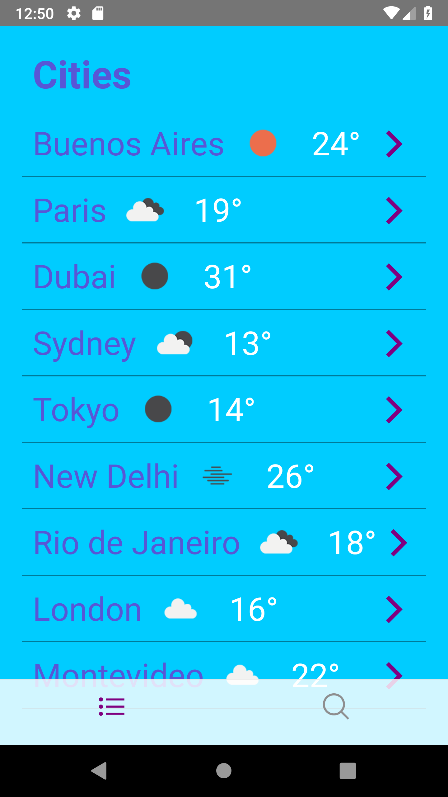
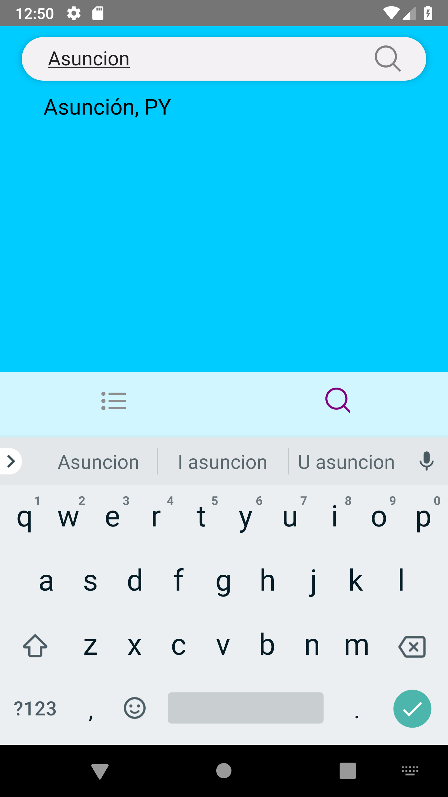
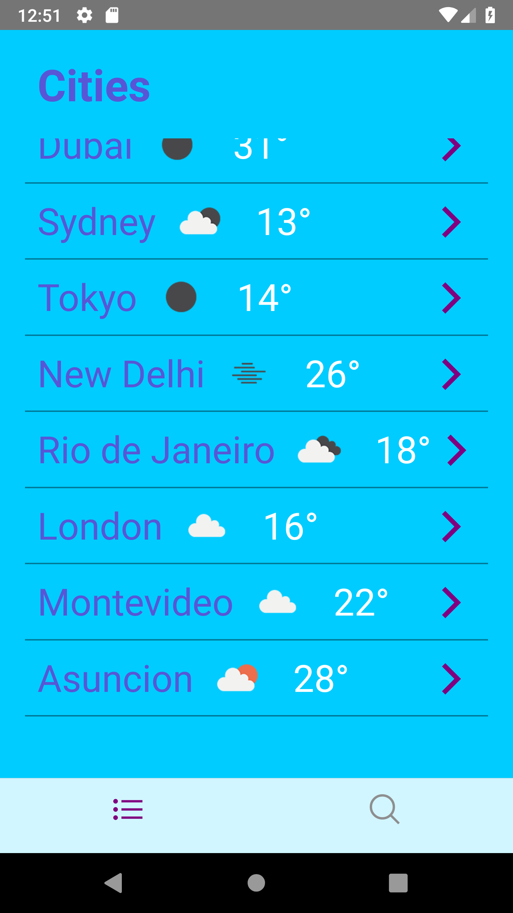

Desafio React Native

Para este desafío se solicita consumir una API de clima hecha en graphql. Se deberá mostrar el listado de ciudades indicadas en un array inicial, y al presionar en una, mostrar un detalle más amplio para cada una.
Requerimientos mínimos

    Usar typescript

    Usar un cliente de graphql para buscar localidades y mostrar su respectivo clima desde la API https://graphql-weather-api.herokuapp.com/.

    El array inicial de localidades está declarado aca ./src/constants

    Cada elemento debe mostrar el nombre de la ciudad, el icono segun el el estado del clima, y la temperatura actual.

    Para obtener el icono, se debe consultar la siguiente url: http://openweathermap.org/img/wn/10d@2x.png, donde "10d" es el id del icono.

    Al presionar en una ciudad, deberemos navegar a otra pantalla donde se mostrará un detalle más amplio. Por ejemplo, podremos detallar la fecha, la temperatura máxima y mínima, las coordinadas, y cualquier otro dato que consideremos relevante.

    Crear componentes reutilizables. Deben ser componentes funcionales y se apreciará el uso de hooks.

    Que funcione en al menos una plataforma (ios | android)

Requerimientos Deseables

    Implementar al menos un test unitario.

    Interfaz estetica

    Buscar localidades nuevas y poder guardarlas como favoritas (usando AsyncStorage y concatenandolas al array inicial).

    Se tendrán en cuenta buenas prácticas

    Se valorará cualquier funcionalidad extra que se quiera agregar.

Sugerencias

Usar apollo y styled-componentes.

 

# To Start 🚀

npm install / yarn install

npx react-native run-android

 
 

 
